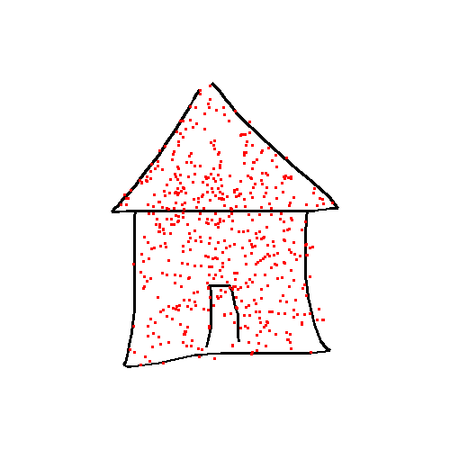
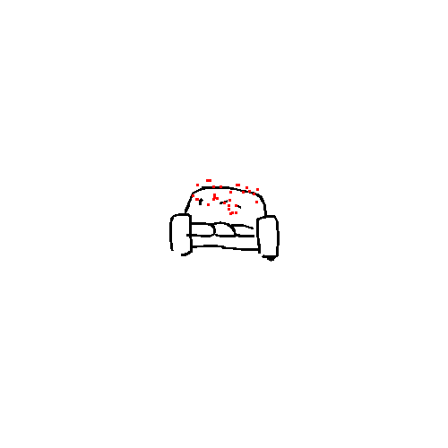
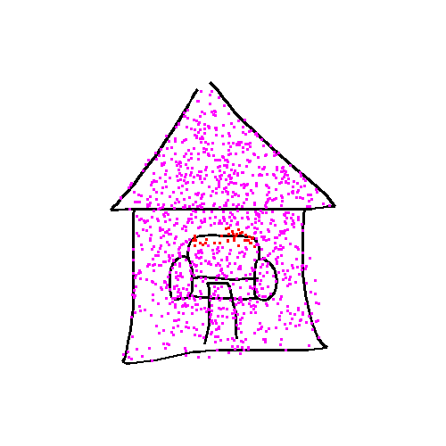

# Drawtomat

Drawtomat is a picture generator which creates pictures from a natural language
description.

## Installation

Following command will set up Python virtual environment:

```console
$ make install
```

This will also download UDPipe trained models.

Then the programme can be executed with following command:

```console
$ make run
```

## Overview

The picture is generated in two phases. These phases are discussed in more 
detail in following sections. 

In the first phase a text description is transformed into a relation graph. 
The graph contains all objects which will be drawn and relations between the 
objects and groups of objects.

The second phases uses relation graph to place objects and compose a scene 
which is then drawn. 


*Picture generation phases diagram*

## Description Processing

Drawtomat uses [UDPipe][1] for tokenization and lemmatization of the picture 
description. UDPipe produces annotated data in [CoNLL-U Format][2]. Trained
UDPipe models are automatically downloaded and saved in `resources/udpipe`
directory by `udpipe` make target. (`run` target depends on `udpipe` target).


*Dependency tree generated with [UDPipe online service][3]*

Dependency tree generated by UDPipe is then traversed using depth-first search.

### Dependency Tree Traversal

The first objective of the tree traversal is to detect objects in the picture.
Every noun in the sentence is used to create an object which will be used in a 
relation graph. The object creation takes place during the node opening. 

After the object is created it is added to an entity stack. An entity can be 
either an object or a group. Groups will be discussed later in this section. 
Each node of the dependency tree has an entity stack frame pointer associated 
with it. The node's pointer points to the top of the stack at the time it was 
opened.

If there is more than a one entity in the entity stack frame during a node 
closing, a group is created which replaces the whole frame.

Adpositions define relations between objects. For every adposition in the 
sentence a relation is created which connects two top entities on the entity
stack. These relations together with entities define the relation graph.

Complex adpositions such as _in front of_, _next to_, etc. consist of
multiple words. Therefore when processing adpositions, context needs to be
taken into account. Drawtomat supports three types of complex adpositions:
1. PP - Preposition Preposition, e.g. _inside of_
2. PNP - Preposition Noun Preposition, e.g. _in front of_
3. AP - Adverb/Adjective Prepositon, e.g. _next to_

Objects from previous sentences can be referenced using definite article _the_.
The most recently created object with matching word associated with it is used.

Adjectives associated with nouns are stored in created objects for future use.

```
Description: A dog and a couch are in a house.
opening:  house
	new Object(house)
opening:  dog
	new Object(dog)
opening:  A
closing:  A
	Frame:	[]
opening:  couch
	new Object(couch)
opening:  and
closing:  and
	Frame:	[]
opening:  a
closing:  a
	Frame:	[]
closing:  couch
	Frame:	[ObjectEntity(couch)]
closing:  dog
	Frame:	[ObjectEntity(dog), ObjectEntity(couch)]
	new Group(2)
opening:  are
closing:  are
	Frame:	[]
opening:  in
	new Relation(in)
closing:  in
	Frame:	[]
opening:  a
closing:  a
	Frame:	[]
opening:  .
closing:  .
	Frame:	[]
closing:  house
	Frame:	[ObjectEntity(house), GroupEntity(2)]
	new Group(2)
```

*Example sentence tree traversal log*

### Relation Graph

Relation graph is a directed graph where entities (objects and groups) are the 
nodes and mutual relations between objects are the edges. An example can be
found in the picture below. 

Formally groups can be seen as nodes and object membership in a group is a 
special relation represented by an edge. However, for the sake of simplicity
the groups will be drawn as containers with objects inside in relation graph
diagrams.


*Example of a relation graph*

## Picture Composition and Generation

### Drawings Dataset 

Drawtomat uses Google's [Quick, Draw!][4] dataset which consists of 345 drawing
categories. The dataset contains more than 50 million drawings, however, only a
selected portion of drawings is used in Drawtomat as the dataset also contains
irrelevant and inappropriate content.

The categories and selected drawings can be found in `resurces/quickdraw` directory.

### Scene Composing

#### Constraints

TODO:



*Example of an "inside constraint"*



*Example of an "on constraint"*


*Example of a "side constraint"*



*Example of a combination of two constraints (inside and on), the magenta points meet only
one constraint whereas the red points meet both constraints*

### Generating Picture from a Composition

## Code Documentation

Code is documented using [Sphinx][5]. Documentation can be generated using
folowwing command:

```console
$ make apidocs
```

[1]: http://ufal.mff.cuni.cz/udpipe "UDPipe"
[2]: https://universaldependencies.org/format.html "CoNLL-U Format"
[3]: http://lindat.mff.cuni.cz/services/udpipe/ "UDPipe Online Service"
[4]: https://quickdraw.withgoogle.com/ "Quick, Draw! dataset"
[5]: https://www.sphinx-doc.org/en/master/ "Sphinx Documentation"
