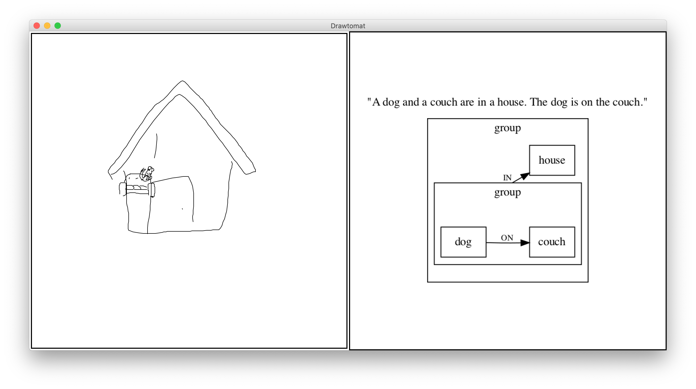
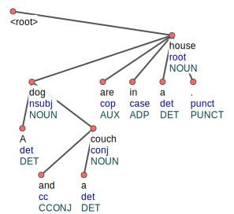
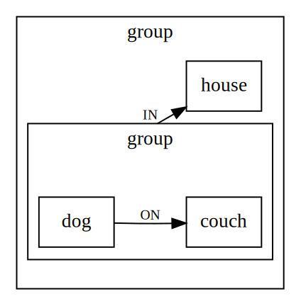
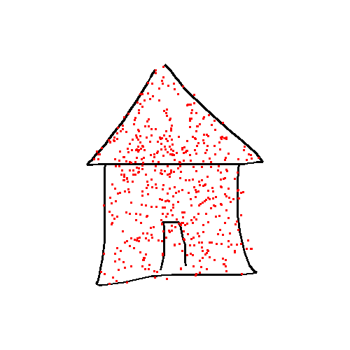
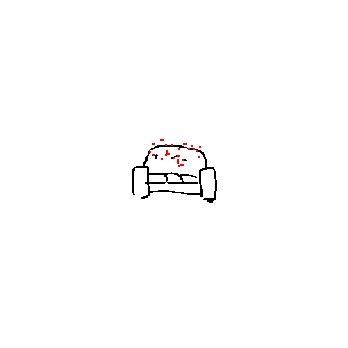
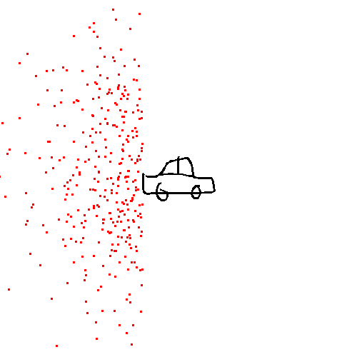
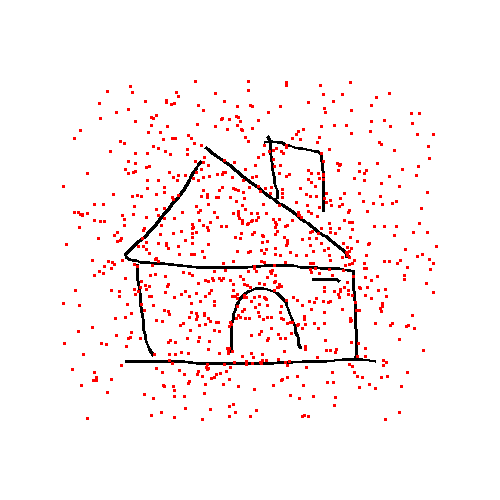
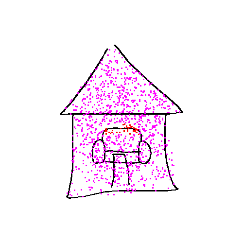

# Drawtomat

Drawtomat is a picture generator which creates pictures based on a natural 
language description.

## Installation

Following command will set up Python virtual environment:

```console
$ make install
```

This will also download UDPipe trained models.

Then the programme can be executed with following command:

```console
$ make run
```

## Overview

The picture is generated in two phases. These phases are discussed in more 
detail in following sections. 

In the first phase a text description is transformed into a relation graph. 
The graph contains all objects which will be drawn and relations between the 
objects and groups of objects.

The second phases uses relation graph to place objects and compose a scene 
which is then drawn. 

<p align="center">

</p>

<p align="center">
<i>Diagram of picture generation phases</i>
</p>

Drawtomat user interface is very simple. It takes the standard input as a
description.

```console
$ make run
Description: A dog and a couch are in a house. The dog is on the couch.
```

<p align="center">
<i>Example input</i>
</p>

After receiving the input an image is generated and a window with the image
and relation graph will show up.

<p align="center">

</p>

<p align="center">
<i>Example output</i>
</p>

## Description Processing

Drawtomat uses *[UDPipe][1]* for tokenization, lemmatization, and dependency 
parsing of the picture description. *UDPipe* produces annotated data in 
*[CoNLL-U Format][2]*. Trained UDPipe models are automatically downloaded and
saved in `resources/udpipe` directory by `udpipe` make target (`run` target 
depends on `udpipe` target).

<p align="center">

</p>

<p align="center">
<i>Dependency tree generated with <a href="http://lindat.mff.cuni.cz/services/udpipe/">UDPipe online service</a></i>
</p>

### Dependency Tree Traversal

Dependency tree generated by *UDPipe* is traversed using depth-first search.

The first objective of the tree traversal is to detect objects which will be
used in the picture. Every noun in the sentence is used to create an object 
which will be used in a relation graph. The object creation takes place during
the node opening. 

After the object is created it is added to an entity stack. An entity can be 
either an object or a group. Groups will be discussed later in this section. 
Each node of the dependency tree has an entity stack frame pointer associated 
with it. The node's pointer points to the top of the stack at the time it was 
opened.

If there is more than a one entity in the entity stack frame during a node 
closing, a group is created which replaces the whole frame.

Adpositions define relations between objects. For every adposition in the 
sentence a relation is created which connects two top entities on the entity
stack. These relations together with entities define the relation graph.

Complex adpositions such as *in front of*, *next to*, etc. consist of
multiple words. Therefore when processing adpositions, context needs to be
taken into account. Drawtomat supports three types of complex adpositions:
1. PP - Preposition Preposition, e.g. *inside of*
2. PNP - Preposition Noun Preposition, e.g. *in front of*
3. AP - Adverb/Adjective Prepositon, e.g. *next to*

Objects from previous sentences can be referenced via definite article *the*.
The most recently created object with matching word associated with it is used.

Adjectives associated with nouns are stored in created objects for future use.

```text
Description: A dog and a couch are in a house.
opening:  house
	new Object(house)
opening:  dog
	new Object(dog)
opening:  A
closing:  A
	Frame:	[]
opening:  couch
	new Object(couch)
opening:  and
closing:  and
	Frame:	[]
opening:  a
closing:  a
	Frame:	[]
closing:  couch
	Frame:	[ObjectEntity(couch)]
closing:  dog
	Frame:	[ObjectEntity(dog), ObjectEntity(couch)]
	new Group(2)
opening:  are
closing:  are
	Frame:	[]
opening:  in
	new Relation(in)
closing:  in
	Frame:	[]
opening:  a
closing:  a
	Frame:	[]
opening:  .
closing:  .
	Frame:	[]
closing:  house
	Frame:	[ObjectEntity(house), GroupEntity(2)]
	new Group(2)
```

<p align="center">
<i>Example sentence tree traversal log</i>
</p>

### Relation Graph

Relation graph is a directed graph where entities (objects and groups) are the 
nodes and mutual relations between objects are the edges. An example can be
found in the picture below. 

Formally groups can be seen as nodes and object membership in a group is a 
special relation represented by an edge. However, for the sake of simplicity
the groups will be drawn as containers with objects inside in relation graph
diagrams.

Drawtomat allows relation graph export in [dot language][6].

<p align="center">

</p>
<p align="center">
<i>Example of a relation graph</i>
</p>

## Picture Composition and Generation

Before the final picture is produced all objects in the relation graph have to
be placed within the scene. The phase of placing the object will be called 
_composition_. Composed scene is then rendered into an image.

### Drawings Dataset 

Drawtomat uses Google's *[Quick, Draw!][4]* dataset which consists of 345 
drawing categories. The dataset contains more than 50 million drawings, 
however, only a selected portion of drawings is used in Drawtomat as the 
dataset also contains irrelevant and inappropriate content.

The categories and selected drawings can be found in 
[`resources/quickdraw`](resources/quickdraw) directory.

The *Quick, Draw!* data are extended with attributes, which at the moment 
contain default object sizes (in centimetres). These data are used for scaling
the objects to preserve natural proportions. Attribute data can be found in 
[`resources/quickdraw/attributes.csv`](resources/quickdraw/attributes.csv). 
If one of the default dimensions is  omitted then only the defined dimension
is used for scaling. If both default dimensions are defined then the drawing is 
scaled by the major dimension.

### Scene Composing

Objects from the relation graph are transformed into physical objects which
have attributes such as scale and position. These physical objects are then
placed in the order given by a topological of a relation graph objects. This
method assumes that the relation graph is acyclic (DAG) hence a topological 
ordering exists.

#### Constraints

Relations in the relation graph (i.e. edges of the graph) define constraints
which a position of an object must meet. These constraints are defined by
binary functions (or callable objects) *R<sup>2</sup> &rarr; {T, F}* which for 
given coordinates return whether the constraint is satisfied.

When placing an object a set of randomly generated points is produced. These
points are tested and if a points meets all the constraints then it is used as
a position of the object. If none of the generated points meets all the 
constraints then a point with the most of constraints satisfied is used as a
position.

If a relation involves a group, corresponding constraint is applied to all of
the group members.

Gaussian distribution is used for generating the points. It is centered around
the average position of objects to which the object to be placed relates.

#### Inside Constraint

This constraint is implemented using point-inside-polygon algorithm where each
stroke is considered a separate polygon (a closed loop). If a point lies in at
least one of these polygons the constraint is satisfied. 

Before running point-inside-polygon algorithm, Ramer–Douglas–Peucker algorithm
is used to simplify (reduce number of vertices) the strokes.

<p align="center">

</p>
<p align="center">
<i>Example of an "inside constraint"</i>
</p>

#### On Constraint

This constraint takes all line segments in the top 25% of a drawing. If the
square distance of a point is within a specified limit the constraint is 
satisfied.

<p align="center">

</p>
<p align="center">
<i>Example of an "on constraint"</i>
</p>

#### Side Constraint

This constraint is satisfied if a point lies on the correct side of a
half-plane. The half-plane is defined by a point which lies on a boundary of
a drawing and by a normal vector (perpendicular to the half-plane boundary). 

For example, this constraint is used by *next to* relation.

<p align="center">

</p>
<p align="center">
<i>Example of a "side constraint"</i>
</p>

#### Box Constraint

Box constraint is satisfied if a point lies in a bounding box of a drawing. The
bounding box can also be scaled.

For example, this constraint is used by *in front of* and *behind* relations 
with different scales.

<p align="center">

</p>
<p align="center">
<i>Example of a "box constraint"</i>
</p>

#### Combination of Multiple Constraints

Following picture shows combination of two constraints. The example uses 
_inside_ constraint which relates to the house and _on_ constraint which 
relates to the couch in the house. Red points satisfy both constraints.

```
[InsideConstraint(house), OnConstraint(couch)]
```

<p align="center">

</p>
<p align="center">
<i>
Example of a combination of two constraints (inside and on), the magenta 
points meet only one constraint whereas the red points meet both constraints
</i>
</p>

#### Adpositions with Corresponding Constraints

| Adpositon   | Constraint Definition             |
| :---------: | :-------------------------------: |
| IN          | InsideConstraint                  |
| INSIDE      | InsideConstraint                  |
| INSIDE_OF   | InsideConstraint                  |
| ON          | OnConstraint                      |
| UNDER       | SideConstraint(direction=(0, 1))  |
| BELOW       | SideConstraint(direction=(0, 1))  |
| ABOVE       | SideConstraint(direction=(0, -1)) |
| BEHIND      | BoxConstraint(scale=0.75)         |
| IN_FRONT_OF | BoxConstraint(scale=1.5)          |
| NEXT_TO     | SideConstraint(direction=(-1, 0)), SideConstraint(direction=(1, 0)) |

### Generating Picture from a Composition

Current implementation uses *[Tkinter][7]* canvas to render the scene. 

## Code Documentation

Code is documented using *[Sphinx][5]*. Documentation can be generated using
following command:

```console
$ make apidocs
```

[1]: http://ufal.mff.cuni.cz/udpipe "UDPipe"
[2]: https://universaldependencies.org/format.html "CoNLL-U Format"
[3]: http://lindat.mff.cuni.cz/services/udpipe/ "UDPipe Online Service"
[4]: https://quickdraw.withgoogle.com/ "Quick, Draw! dataset"
[5]: https://www.sphinx-doc.org/en/master/ "Sphinx Documentation"
[6]: https://graphviz.org/doc/info/lang.html "Graphviz Dot Language"
[7]: https://docs.python.org/3/library/tkinter.html "Tkinter"
